## log4e插件使用

Log4E的官方网址为：http://log4e.jayefem.de/，有时会出现大不开的情况，这可能跟网络有关，尝试刷新或换其他的浏览器试试。

图为打开后的界面：

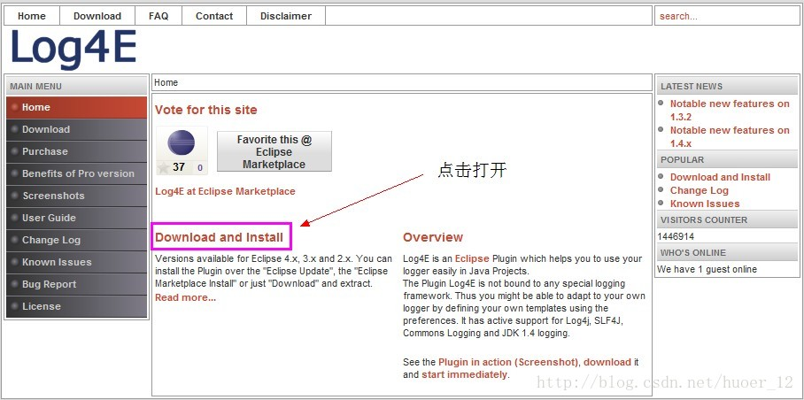

打开如图所示的链接，准备下载Log4E:

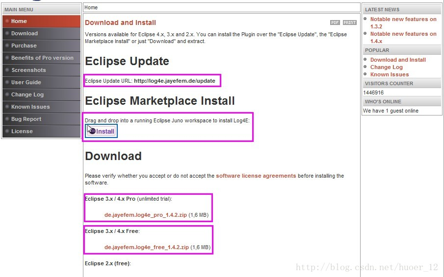

Eclipse Update

Eclipse Update URL: http://log4e.jayefem.de/update

这就是在Eclipse中安装的URL，步骤：

1.Help----Install New Software...

2.打开Install对话框，在Work with中粘贴 http://log4e.jayefem.de/update 地址，也可点击”Add“按钮，打开 Add Repository 对话框，添加 Name 和 Location 。Name值可以随便填写，Location中写入 http://log4e.jayefem.de/update 地址，点击”OK“按钮即可。

3. 然后等待搜索，如图结果：

按照提示向下进行即可。

在安装向导界面，网站还提供了其他的安装方法，如：

Drag and drop into a running Eclipse Juno workspace to install Log4E:

拖动下面的那个图标到打开的Eclipse中；

还有最常见的方法就是下载jar包，然后放到Eclipse目录下的plugin目录中。

eclipse的目录结构：

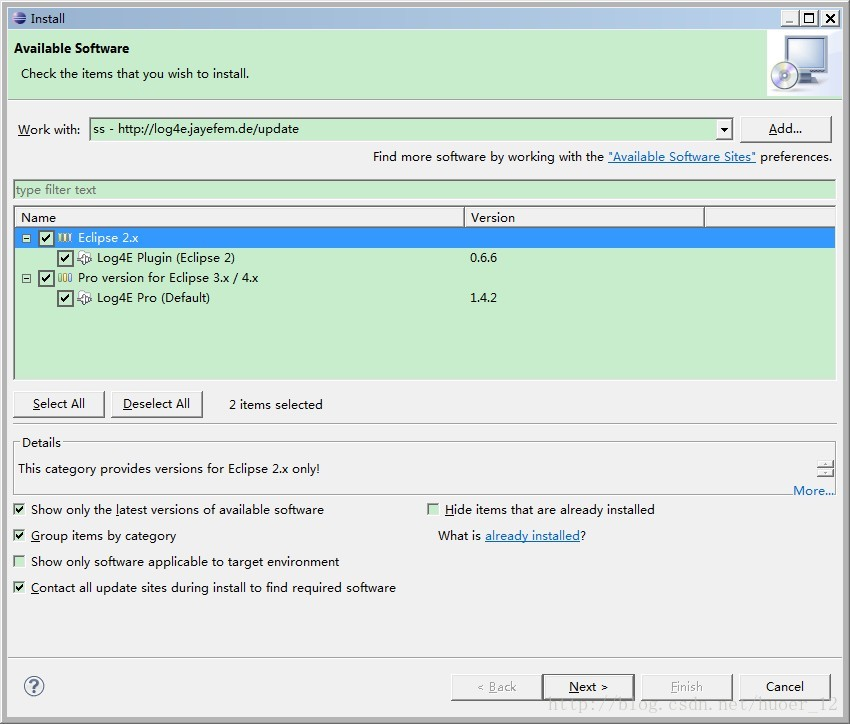

一般的情况是将插件的JAR包直接放到plugins目录中，然后重启eclipse，即可；

还有就是有的插件解压后有plugins目录和features目录，这样的话直接将这两个文件夹粘贴，和原来的文件夹进行合并；

还可将将插件的JAR放到dropins目录中，然后启动eclipse，可装入插件。

以上方法都可行，自己可以尝试，还有以一种就是关于使用links的做法，没有尝试过，读者可自行查看，尝试。

关于Log4E的版本有Free和 Pro 版本，Free版本的话就是免费的，但其中的一些更能呢是限制使用的，而Pro是需要注册的，可使用全部的功能，自己可以看着下载安装。

安装好的Log4E插件可在Window ------  Preferences 找到 Log4E 节点：

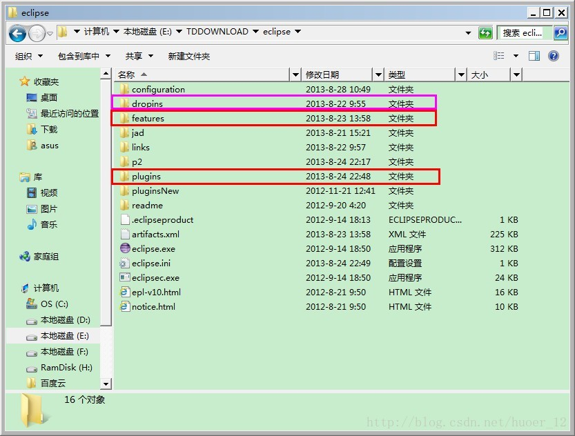

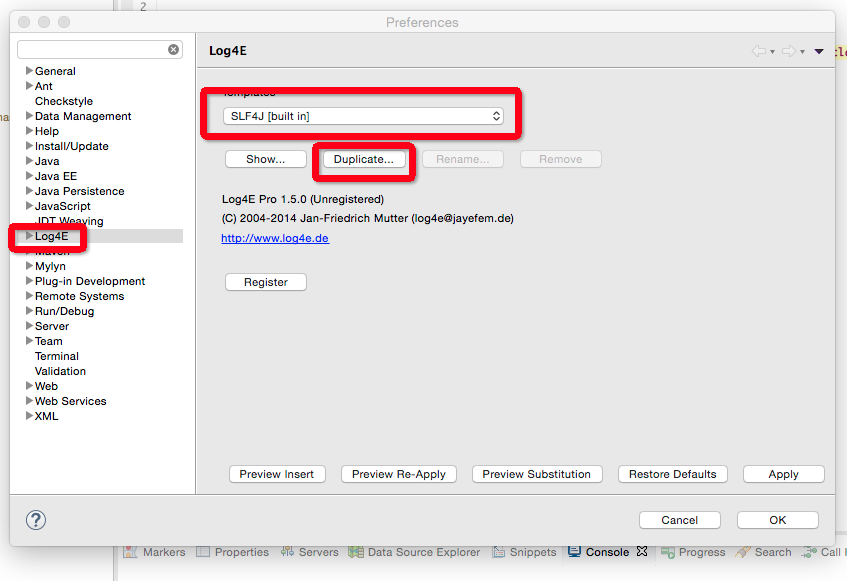

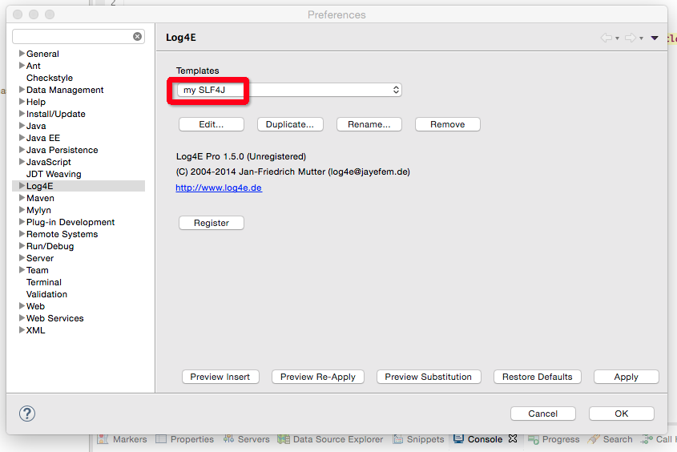

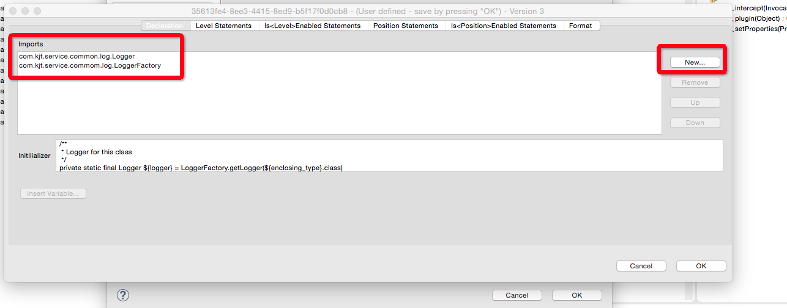

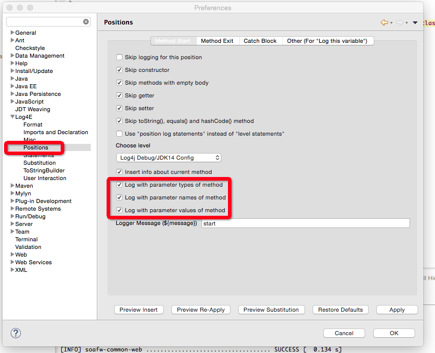

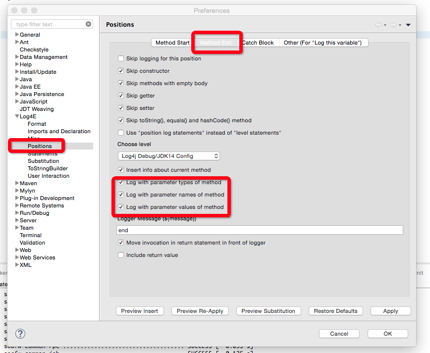

log4e使用标准［service层统一使用info级别、dao层使用debug级别］

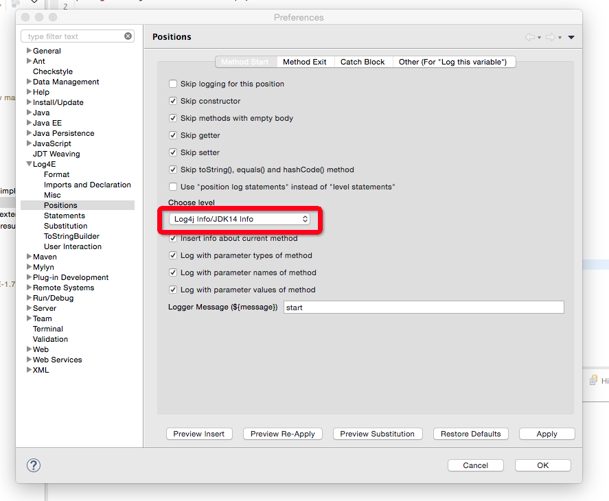

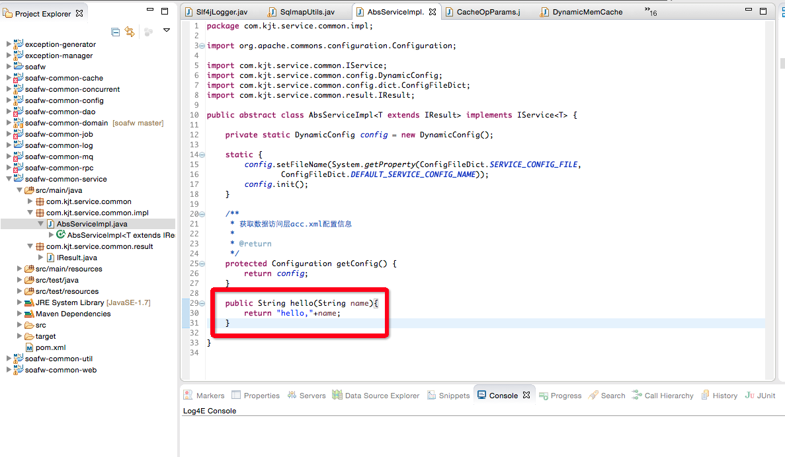

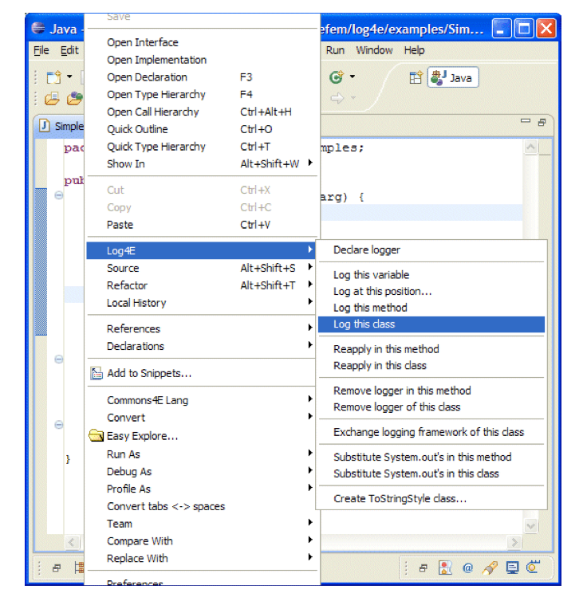

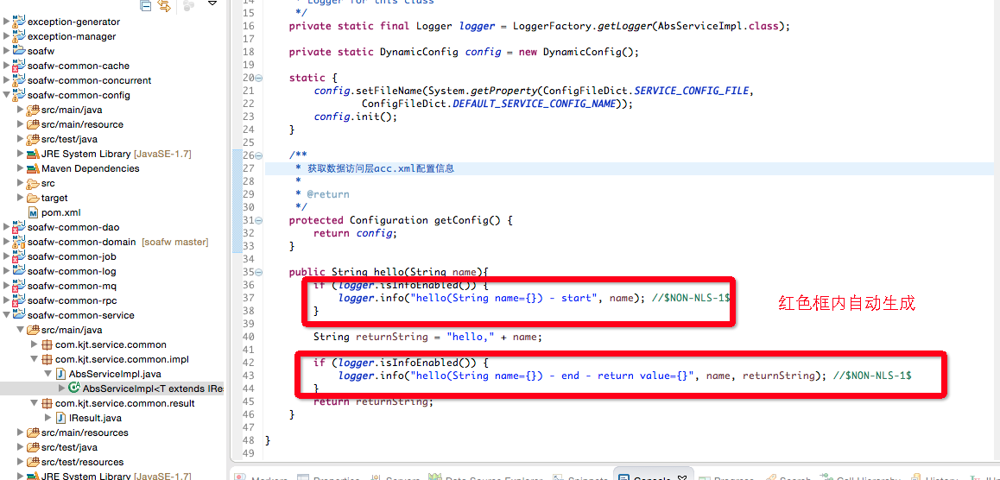